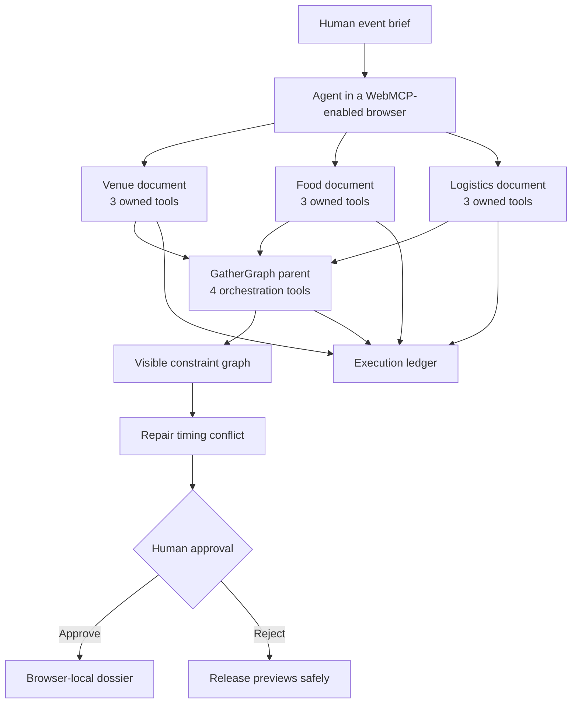

# GatherGraph architecture

## Tool ownership

| Document           | Tools                                                                                                    | Responsibility                                                 |
| ------------------ | -------------------------------------------------------------------------------------------------------- | -------------------------------------------------------------- |
| Venue iframe       | `find_spaces`, `check_accessibility`, `hold_space_preview`                                               | Capacity, access, and reversible venue preview                 |
| Food iframe        | `build_menu`, `check_allergens`, `reserve_menu_preview`                                                  | Menu, allergen evidence, and reversible menu preview           |
| Logistics iframe   | `plan_delivery_window`, `estimate_footprint`, `reserve_route_preview`                                    | Timing, illustrative impact, and reversible route preview      |
| GatherGraph parent | `compose_event_plan`, `repair_constraint_conflicts`, `request_plan_approval`, `commit_simulated_dossier` | Cross-provider composition, repair, consent, and local dossier |

## Runtime behavior

When `document.modelContext` is available, each document registers only the tools it owns. In unsupported development browsers, the parent exposes equivalent namespaced tools through a local fallback while retaining separate visible provider documents. Native and fallback execution use the same tool definitions, visible state changes, and execution ledger.

## Consequence boundary

Provider previews are read-only or reversible. Conflict repair changes only visible local state. Approval creates a receipt but does not contact a provider. The final dossier requires that receipt and remains browser-local.
